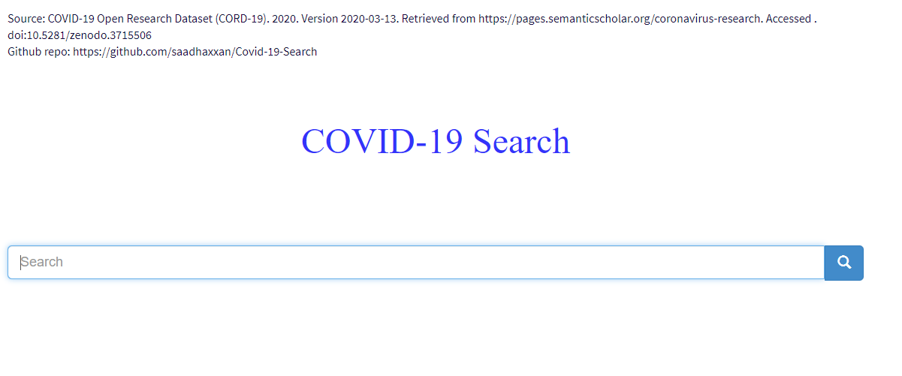
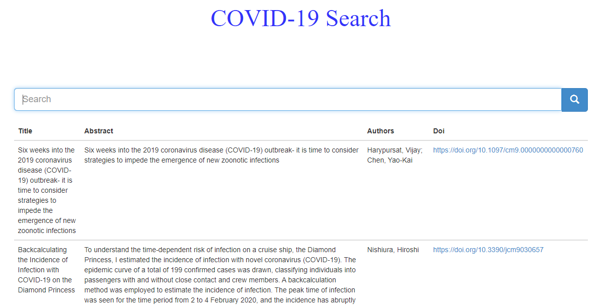

<h1 align="center">Covid-19 Search Engine</h1>
<a href="#">
  <div align="center">
    
  </div>
</a>
A short search engine to search for most relevent Corona Virus research papers published on the internet.[Visit Live app](https://covid-19-search.herokuapp.com)

[](#)
[](#)
[](https://github.com/saadhaxxan/Covid-19-Search/fork)
[](https://github.com/saadhaxxan/Covid-19-Search/issues)
[](#)

## Resources
Search engine for bibliography related to covid-19 from: 
- COVID-19 Open Research Dataset (CORD-19). 2020. Version 2020-03-13. Retrieved from https://pages.semanticscholar.org/coronavirus-research. Accessed 2020-03-23. doi:10.5281/zenodo.3715506

Part of this code is completely based on the contributions of @joseherazo on github:

- https://github.com/joseherazo04/Covid19-SearchEngine

# Installation

```
pip install -r requirements.txt
python app.py
```

## Working Demo
<a href="#">
  <div align="center">
    
  </div>
</a>

## Data Provided
- Title of Paper
- Abstract of Paper
- Authors
- Doi url


## Deployment on heroku

```
cd project
git init
heroku create
heroku git:remote -a herokuappname
git add .
git commit -am "make it better"
git push heroku master
```
